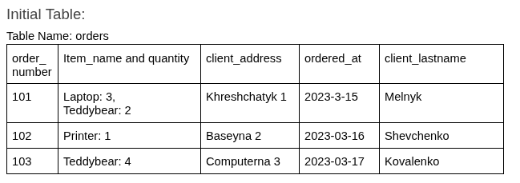
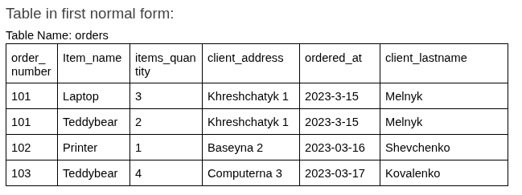
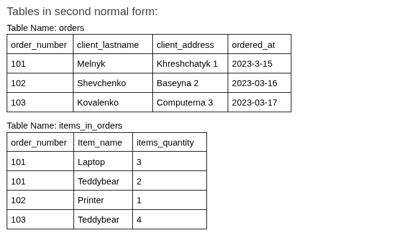
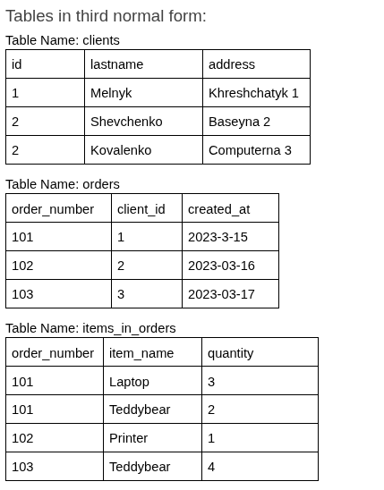
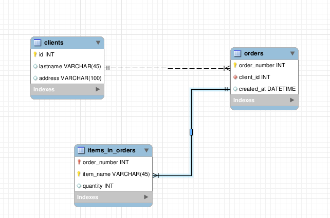
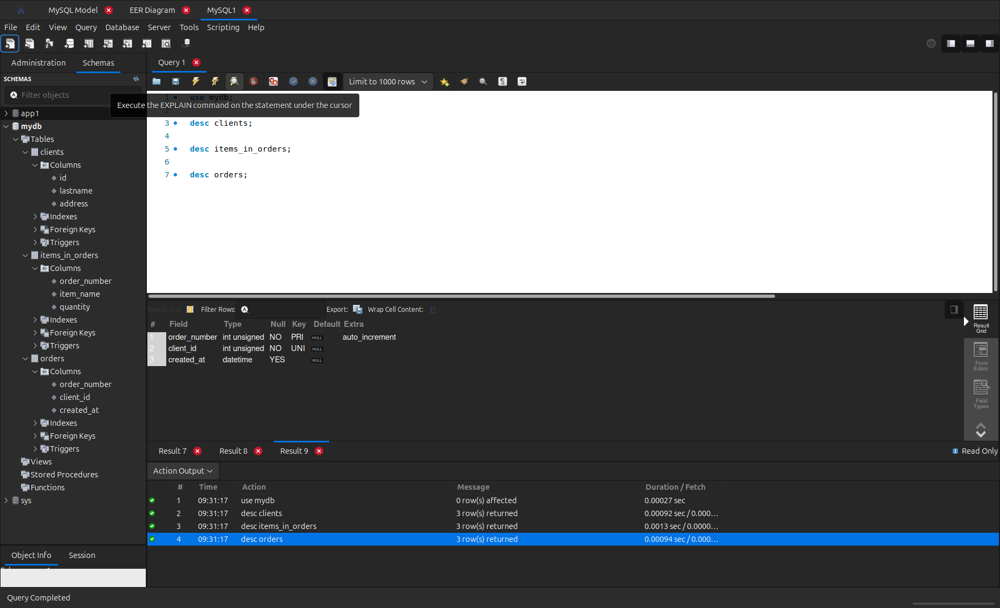

1. Прикріплені посилання на репозиторій goit-rdb-hw-02 та безпосередньо самі файли репозиторію архівом.

2. Нормалізовано таблицю до 1НФ.

3. Нормалізовано таблицю до 2НФ.

4. Нормалізовано таблицю до 3НФ.

5. Створено ER-діаграму отриманих таблиць. Діаграма має відповідати нормалізованим таблицям.

6. Використано зрозумілі та конкретні імена для сутностей та атрибутів. Уточнено типи даних для атрибутів. Усі відношення й атрибути мають чіткі і зрозумілі кардинальності та значення.

7. Створено таблиці в базі даних (тільки таблиці й колонки з урахуванням зв'язків) вручну або автоматично.

